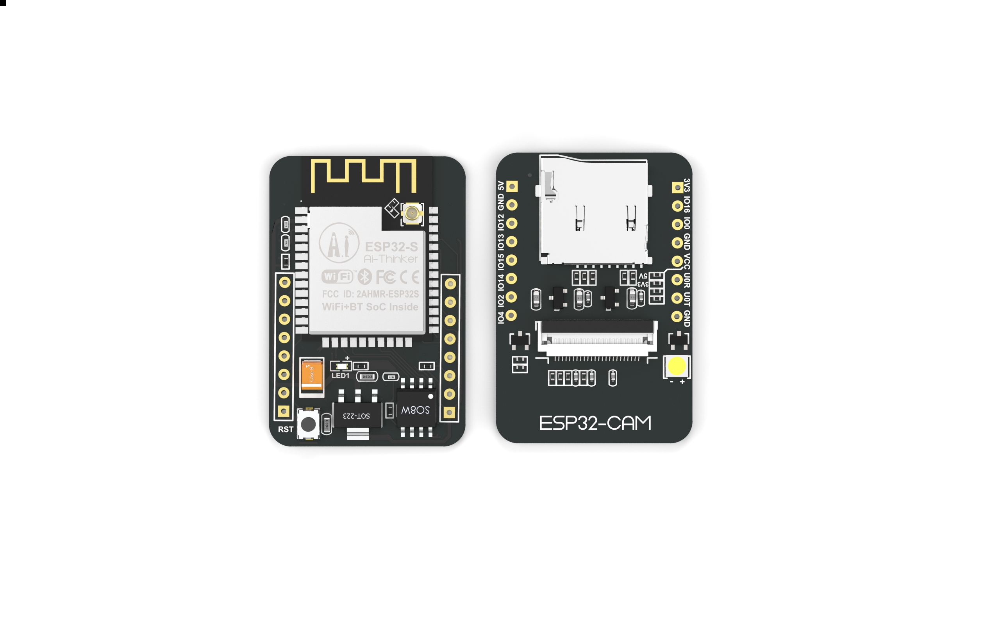
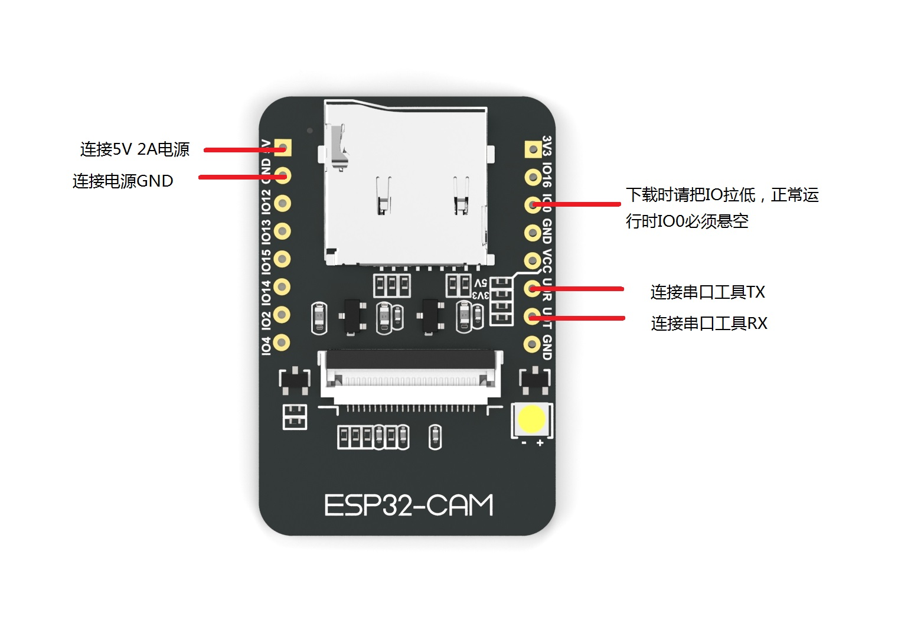

# ESP-CAM

ESP-CAM 是基于ESP_WHO开发的一个面部检测和识别平台，使用Espressif Systems的ESP32芯片。

# 概述
ESP32-CAM是安信可发布小尺寸的摄像头模组。该模块可以作为最小系统独立工作，尺寸仅为27*40.5*4.5mm。
ESP32-CAM可广泛应用于各种物联网场合，适用于家庭智能设备、工业无线控制、无线监控、人脸识别以及其它物联网应用，是物联网应用的理想解决方案。
ESP32-CAM采用DIP封装，直接插上底板即可使用，实现产品的快速生产，为客户提供高可靠性的连接方式，方便应用于各种物联网硬件终端场合。
体积超小的802.11b/g/n Wi-Fi + BT/BLE SoC模块。



在ESP_CAM中，集成了SDcrad，uart，SNTP，smartconfig等功能，提供了快速开发环境，进行了功能验证，减少开发周期。

* **基本功能模块** 提供了SDcrad，uart，SNTP，smartconfig功能.

* **视频输入输出控制** 通过摄像头的输入，视频流通过http服务输出，并在http界面提供了操控摄像头接口.

* **人脸检测识别** 通过http界面的控制功能即可开启人脸检测识别的功能.**注意:ESP_CAM输入分辨率可通过http调整，人脸检测识别功能暂时只支持320*240的分辨率**.

* **图像拍摄保存** 在不同url接口可实现图像的拍摄与保存，保存地址为PC端.


# 快速入门

## 硬件准备

* ESP_CAM模块开发板
* 串口模块（USB-TTL）
* 杜邦线
* PC
* 硬件接线:


## 软件环境
### 环境搭建
* 使用安信可开发环境：[如何安装安信可一体化开发环境](https://docs.ai-thinker.com/ai_ide_install)，[如何使用安信可 ESP 系列一体化开发环境](https://docs.ai-thinker.com/ai_ide_use)，[如何为 ESP 系列模组烧录固件](https://docs.ai-thinker.com/esp_download)
* 自己搭建环境：https://esp-idf.readthedocs.io/zh_CN/latest/get-started/index.html 
* ESP_CAM SDK下载（esp-idf使用V4.0.0）：

# SDk目录简介

## Components

组件是SDK的主要框架，内部包含一些驱动程序和算法

## Camera

该相机组件包含ESP32的相机设备的驱动程序。

## esp-face

该ESP面组件包含的API的神经网络，包括人脸检测与识别的框架。

# Examples
示例文件夹包含演示API功能的示例应用程序。

工程示例：
1. 进入示例工程 `esp_cam\examples\single_chip\camera_web_server`.
```
cd esp_cam\examples\single_chip\camera_web_server
```

2. 依照串口模块接线，编译并刷新项目
```
make build
make flash -p [PORT]//如果使用menuconfig配置的默认参数则不需要“-p [PORT]”参数
```
3. 高级用户可以使用命令修改某些选项 `make menuconfig`.

4. 接入串口模块的情况下，在Linux环境打开监控器,也可win不输入命令，直接打开串口助手
```
make monitor
```
5. 使用手机进行smartconfig配网，在手机接入wifi情况下，进行配网

6. 配网成功，PC打开浏览器输入为模块分配的ip即可监控到摄像头数据

检查每个示例的README.md可以获取更多详细信息。


# Resources

* [Check the Issues section on github](https://github.com/espressif/esp-who/issues) if you find a bug or have a feature request, please check existing Issues before opening a new one.

* If you're interested in contributing to ESP-CAM, please check the [Contributions Guide](https://esp-idf.readthedocs.io/en/latest/contribute/index.html).
